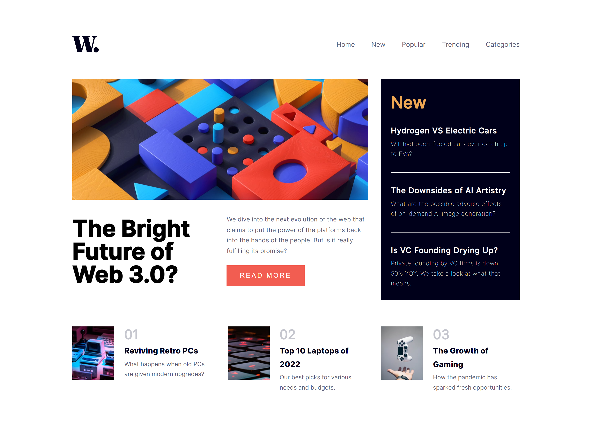

# Frontend Mentor - News homepage solution

This is a solution to the [News homepage challenge on Frontend Mentor](https://www.frontendmentor.io/challenges/news-homepage-H6SWTa1MFl). Frontend Mentor challenges help you improve your coding skills by building realistic projects. 

## Table of contents

- [Overview](#overview)
  - [The challenge](#the-challenge)
  - [Screenshot](#screenshot)
  - [Links](#links)
- [My process](#my-process)
  - [Built with](#built-with)
  - [What I learned](#what-i-learned)
  - [Useful resources](#useful-resources)
- [Author](#author)

## Overview

### The challenge

Users should be able to:

- View the optimal layout for the interface depending on their device's screen size
- See hover and focus states for all interactive elements on the page
- **Bonus**: Toggle the mobile menu (requires some JavaScript)

### Screenshot




### Links

- Solution URL: [news homepage GitHub](https://github.com/LucasNahuel/fem-news-homepage)
- Live Site URL: [news homepage deployment](https://fem-news-homepage-three.vercel.app/)

## My process

### Built with

- HTML5
- CSS custom properties
- Flexbox
- CSS Grid
- [React](https://reactjs.org/) - JS library


### What I learned

This is the first time i used grid layout, as the first pattern that i saw in the design was a grid-like disposition.

```html
  <div className='grid-container'>  
      //the news articles

  </div>
```

And then, in the css:

```css

  .grid-container{
    display: grid;
    grid-template-columns: auto auto 31%;
  }

```


I've learnt to declare and use css variables and it's scopes, like this:

```css
:root{
  --Salmonish: #f25d51;
}

.read-more-button{
  color: var(--Salmonish);
}
```


I had problems placing the "read more" button at the bottom of it's container. Making the upper paragraph element having a height of 100% just made it jump way to much under. I guess it's something to do with it being into a grid container. 
In order to fix it, i discover that you can make a container relative and his child absolute with a position directive to make it to move in the bounds of his parent. For sticking the button to the bottom, i used bottom: 0. Like this:

```css
  .parent-container{
    position: relative;
  }

  .child-read-me-button{
    position: absolute;
    bottom: 0;
  }
```

I also learnt to use the letter-spacing property, and line-height for text elements, as i realized that no matter which font size i used, the letters did not appear like in the design:

```css
  .read-more-button{
    letter-spacing: 0.2em;
  }

  h1{
    line-height: 1em;
  }
```


### Useful resources

- [W3S Grid Layout Guide](https://www.w3schools.com/css/css_grid.asp) - Helped my understanding the grid layout

- [Sticking element at the bottom of parent element](https://stackoverflow.com/questions/526035/how-can-i-position-my-div-at-the-bottom-of-its-container) - Helped my positioning the read more button while in a grid layout.

- [Declaring and using CSS variables](https://developer.mozilla.org/en-US/docs/Web/CSS/Using_CSS_custom_properties) - helped me to use not re-write all the colors defined in the design guidelines.

- [Mozilla developer Letter-spacing tutorial](https://developer.mozilla.org/en-US/docs/Web/CSS/letter-spacing#:~:text=The%20letter%2Dspacing%20CSS%20property,characters%20while%20rendering%20the%20text.) - helped my solving the primary new header and "read more" button disposition.

- [Mozilla developer Line-height tutorial](https://developer.mozilla.org/en-US/docs/Web/CSS/line-height) - helped my recreating the disposition of the paragraphs fonts


## Author

- Website - [Lucas Munoz](https://angular-portfolio-lake.vercel.app/)
- Frontend Mentor - [@LucasNahuel](https://www.frontendmentor.io/profile/LucasNahuel)


